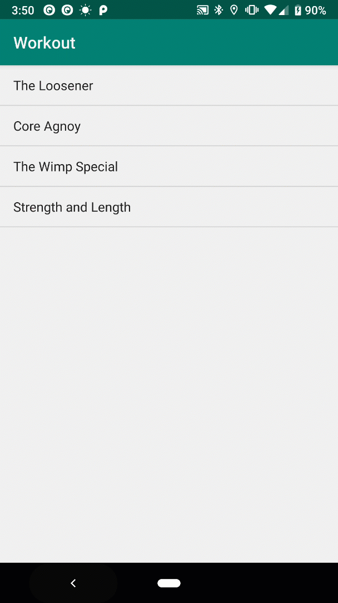

**Android Development: Multiple App Screens**

I recently finished the Multiple App Screens lesson on Udacity which is the 3rd course of the curriculum for Android Development for Beginners.

The things I’ve learned:

- Pre-loading a work in progress app provided by the course

- Figuring what needed to be updated

- Using intents to open multiple activities

- Understanding Activity Lifecycle of the app

- Array, Lists, Loops and Custom Classes

Unfortunately, the Udacity course did not go over fragments in detail. I used Head First Android Development (2nd Edition) to learn fragments and went through the exercise to understand this concept as I knew this was required for a slider tab.

The most important concept I’ve learned from their exercise was how to use fragments and make the apps appear on different layouts. Fragments are very similar to activities as they have associated layouts. It allows you to reuse code instead of duplicating the codes in separate activities.

Understanding how fragments and activities communicate was the hardest challenge in this exercise. However, after going through the exercise and finally building with fragments made this easier to understand. Below shows an example of the fragments being used to display two activities at once. Minimal code was used to generate this type of UI. For larger screen sizes such as tablets, fragments can be used side by side to take up the extra screen real estate.

Take away points:

- Fragment’s are used to control part of a screen

- Fragments have associated layouts

- `onCreateView()` method is called every time Android requires the fragment layout

- We use the `<fragment>` element and name attribute to reference in XML

- Fragments do not extend Activity class or implement Contents class

- Fragments use the `getView()` method to be referenced and then `findViewById()`
