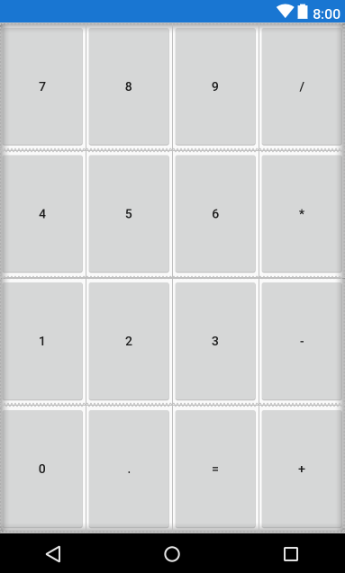

The best way for me to retain the knowledge is to take small steps and implement what I’ve learned by building simple apps. The database topic was very dry and I felt like I was drifting away from what I learned recently. A short break from Udacity was needed.

First and foremost, I spent a lot of time researching tips for beginners who are starting out in Android Development. There are tons of valuable tips from experienced programmers who have gone through this journey. As someone who is starting off, I made sure to start off on the right foot by avoiding common mistakes and creating good habits. I found 2 really good resources below:

1. [50 Ultimate Resources to Master Android Dev (Medium Blog Compilation)](https://blog.aritraroy.in/50-ultimate-resources-to-master-android-development-15165d6bc376)

2) [Android Best Practices (Github Resource Library)](https://github.com/futurice/android-best-practices)

For the calculator app, I made multiple **fragments** instead of building in one activity. Fragments are reusable components or sub activities. They can be used to control certain parts of the screen and allows for a more versatile control over [multiple devices](https://kiendang.me/index.php/2018/11/11/journey-to-android-development-pt-2/).

## <center>**Building the Calculator UI** </center>

The first fragment was the `input_fragment` seen below:


Grid Layout with Buttons

Multiple buttons in a grid like manner was achieved using LinearLayout XML

```xml
    <LinearLayout
       android:orientation="horizontal"
       android:layout_width="match_parent"
       android:layout_height="0dp"
       android:layout_weight="1">
    </LinearLayout>
```

Key points:

1. Specified the orientation to be horizontal which is the primary layout we need to stack buttons

2. Height is equal to `0dp` because we want to make it stretch as much as the device will allow it to stretch based on the number of rows we create

3. Weight is considered to be 1 so that all buttons can be equal.

Another fragment was created called the `fragment_display`, which will allow us to see the input the from the calculator app. This fragment will also show the delete button:


Since these fragments are separated from the main activity, I’ll combine the two in the order they are displayed as seen below:


Code snippet below:

```xml
    <RelativeLayout xmlns:android="http://schemas.android.com/apk/res/android"
       android:id="@+id/root_activity_calculator"
       xmlns:app="http://schemas.android.com/apk/res-auto"
       xmlns:tools="http://schemas.android.com/tools"
       android:layout_width="match_parent"
       android:layout_height="match_parent"
       tools:context=".CalculatorActivity">

       <fragment
           android:id="@+id/fragment_display"
           android:layout_width="match_parent"
           android:layout_height="wrap_content"
           android:name="com.example.kien.calculator.DisplayFragment"
           tools:layout="@layout/fragment_display" />

       <fragment
           android:id="@+id/fragment_input"
           android:layout_width="match_parent"
           android:layout_height="match_parent"
           android:name="com.example.kien.calculator.InputFragment"
           tools:layout="@layout/fragment_input"
           android:layout_below="@+id/frag_display"/>

    </RelativeLayout>
```

Lastly, using the `styles.xml` resource file which combines all styles under a name, I was able to follow the [material design guidelines](https://material.io/design/) and generate the [material design colour palette.](https://www.materialpalette.com/)

```sql
    <resources>
       <style name="ButtonNumberPad" parent="Widget.AppCompat.Button">
           <item name="android:textColor">@android:color/white</item>
           <item name="android:background">@color/colorPrimary</item>
           <item name="android:textSize">34sp</item>
       </style>
       <style name="ButtonOperation" parent="Widget.AppCompat.Button">
           <item name="android:textColor">@android:color/white</item>
           <item name="android:background">@color/colorPrimaryDark</item>
           <item name="android:textSize">34sp</item>
       </style>
       <style name="TextViewDisplay">
           <item name="android:textSize">56sp</item>
           <item name="android:gravity">center_vertical|right</item>
           <item name="android:maxLines">1</item>
       </style>
       <style name="ScrollViewDisplay">
           <item name="android:paddingLeft">16dp</item>
           <item name="android:paddingRight">16dp</item>
       </style>
       <style name="ImageButtonDisplay" parent="Base.Widget.AppCompat.ImageButton">
           <item name="android:alpha">.54</item>
           <item name="android:background"></item>
       </style>
    </resources>
```

The `parent` in the style tag allows us to target the Android specific default styling. The colours are defined in the `colors.xml` file.
