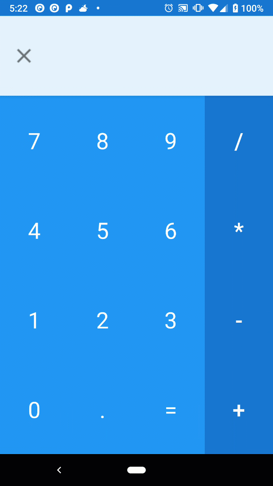
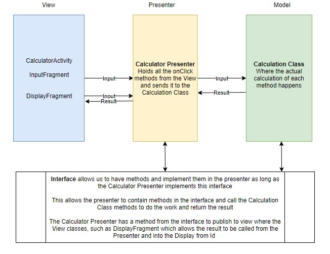

Here’s my completed Calculator App in action!



One of the things I wanted to do before I started going into Android Development is to research and really understand the tools available for building apps. By implementing Androids best practices, this will help me develop the proper skill to adapt and streamline any changes.

The summary of this project exposed to me to:

1. Model-View-Presenter - using proper architectural patterns

2) Interfaces - remove dependencies on specific classes

3. Fragments - how to properly implement them

4) Importing libraries - making use of libraries instead of reinventing the wheel

**Model View Presenter**

For this app, I went with the model-view-presenter architectural pattern for building applications. I found this information here in this [link](https://medium.com/cr8resume/make-you-hand-dirty-with-mvp-model-view-presenter-eab5b5c16e42) which helps explain the fundamentals of an MVP. Below is my hand made diagram of understanding what went on with my calculator app.



**Interfaces (from what I understand)**

Interfaces are similar to classes, they contain only constants, method signatures, default methods, static methods and nested types. They cannot be instantiated and only be implemented by classes or extended by other interfaces

In short, for Android, interfaces are used so we can disconnect the button class from the specific activity. By doing so, we remove the dependency and allows classes to communicate through an interface instead of calling methods on specific classes. So we can create multiple buttons and re-use them in different fragments.

How does this help?

For example, if we had to create a widget in fragments, we can pass the Fragment activity through the button as long as the Fragment is implementing the interfaces. This allows us to reduce tight coupling, direct independency between activities and buttons. Therefore, giving us a more adaptable code base to handle any changing requirements in our app.

Example of the interface code used in CalculatorContract (Interface):

```java
    public interface CalculatorContract {

       //Our View handles these methods (DisplayFragment)
       interface PublishToView{
           void showResult(String result);
           void showToastMessage(String message);
       }

       //passes click events from our View (DisplayFragment), to the presenter
       interface ForwardDisplayInteractionToPresenter {
           void onDeleteShortClick();
           void onDeleteLongClick();
       }

       //passes click events from our View (InputFragment) to the presenter
       interface ForwardInputInteractionToPresenter {
           void onNumberClick(int number);
           void onDecimalClick();
           void onEvaluateClick();
           void onOperatorClick(String Operator);


       }

    }
```

These methods would be called in the Presenter called `CalculatorPresentor`. The java class will implement the `ForwardDisplayInteractionToPresenter` and `ForwardInputInteractionToPresenter` and `CalculationResult` from the Calculation class.

The Calculation Class is what drives our actual calculation and pushes it back to the Presenter Class which allows it to push to `DisplayFragment`

**Fragments**

I used two fragments in this calculator app. Fragments allow to adjust for multiple screen sizes which allow for more flexibility.

**Importing Libraries (Android Implementation)**

My first time importing libraries and I’ve had issues getting my Gradle to work. After 30 minutes of constant messing around with versions and a bunch of stackoverflow questions later, I was able to get Butter Knife installed.

**Butter Knife**

[Butter Knife](http://jakewharton.github.io/butterknife/) was used to simplify the binding of buttons ID and make them much easier to deal with.

Without this library, I would have had to declare and set all my buttons below and declare an onClick method for every individual button. For example, assigning onClick Listeners for Buttons one and two only..

```java
    private Button one;
    private Button two;

    public View onCreateView(Layout Inflator, ViewGroup Container, Bundle savedInstanceState) {

         View v = inflater.inflate(R.layout.fragment_input, container, false);

          one (Button) = v.findViewById(R.id.ButtonOne);
          one.setOnClickListener(new View.OnClickListener() {
    	@Override
    	Public void onClick(View view) {
                }
          }

          two (Button) = v.findViewById(R.id.ButtonTwo);
          two.setOnClickListener(new View OnClickListener() {
    	@Override
    	Public void onClick(View view) {
                }
          }

    Return v

    }
    .... This would need to continue on for 14 other buttons which will make our code very long and repetitive.
```

To circumvent this long code, Butter Knife allows you to do the following by adding ButterKnife.bind(this, v); to the onCreateView method to create our annotations:

For the `onClick` shortcut, we can create the method `onNumberClick`.

The `@OnClick` is a Butter Knife annotation and assigns all the buttons by throwing it in the array below and associating it with one method we created `OnNumberClick` based on which button was clicked in the array.

```java
    @OnClick({R.id.ButtonOne, R.id.ButtonTwo, R.id.ButtonThree, R.id.ButtonFour,
           R.id.ButtonFive, R.id.ButtonSix, R.id.ButtonSeven, R.id.ButtonEight,
           R.id.ButtonNine, R.id.ButtonZero})

    public void onNumberClick(Button v) {

       forwardInteraction.onNumberClick(Integer.parseInt(v.getText().toString()));
```

**Arity Library**

Arity helps evaluate arithmetic expressions represented as strings. Basically, it will take my expression which is in a string and evaluate it mathematically by converting my string operators into actual mathematical operations.

One advice I came across was that I should try focusing on building apps instead of reinventing core functionality that someone has already created. Importing libraries will help reduce time significantly in building apps. This will give me practice in reading documentation of other libraries and figuring out how to use them effectively. I found this to be a very helpful exercise.

My calculation code snippet is below:

```java
    public class Calculation {

       private final Symbols symbols;
       private CalculationResult calculationResult;
       private static String currentExpression;

       interface CalculationResult {
           void onExpressionChanged(String result, boolean successful);
       }

       public void setCalculationResultListener(CalculationResult calculationResult) {
           this.calculationResult = calculationResult;
           currentExpression = "";
       }

       public Calculation() {
           symbols = new Symbols();
       }

       public void deleteCharacter() {
           if (currentExpression.length() > 0) {
               currentExpression = currentExpression.substring(0, currentExpression.length() - 1);
               calculationResult.onExpressionChanged(currentExpression, true);
           } else {
               calculationResult.onExpressionChanged("Invalid Input", false);
           }

       }

       public void deleteExpression() {
           if (currentExpression.equals("")) {
               calculationResult.onExpressionChanged("Invalid Input", false);
           }
           currentExpression = "";
           calculationResult.onExpressionChanged(currentExpression, true);
       }

       public void appendNumber(String number) {
           if (currentExpression.startsWith("0") && number.equals("0")) {
               calculationResult.onExpressionChanged("Invalid Input", false);
           } else {
               if (currentExpression.length() <= 16) {
                   currentExpression += number;
                   calculationResult.onExpressionChanged(currentExpression, true);
               } else {
                   calculationResult.onExpressionChanged("Expression too long", false);
               }
           }
       }

       public void appendOperator(String operator) {
           if (validateExpression(currentExpression)) {
               currentExpression += operator;
               calculationResult.onExpressionChanged(currentExpression, true);
           }

       }

       public void appendDecimal() {
           if (validateExpression(currentExpression)) {
             currentExpression += ".";
             calculationResult.onExpressionChanged(currentExpression, true);
           }
       }

       public void performEvaluation() {
           if (validateExpression(currentExpression)) {
               try {
                   Double result = symbols.eval(currentExpression);
                   currentExpression = Double.toString(result);
                   calculationResult.onExpressionChanged(currentExpression, true);
               } catch (SyntaxException e) {
                   calculationResult.onExpressionChanged("Cannot read this", false);
                   e.printStackTrace();
               }
           }


       }

       public boolean validateExpression(String expression) {
           if (expression.endsWith("*") ||
                   expression.endsWith("/") ||
                   expression.endsWith("-") ||
                   expression.endsWith("+")) {
               calculationResult.onExpressionChanged("Invalid Input", false);
               return false;
           } else if (expression.equals("")) {
               calculationResult.onExpressionChanged("Empty Expression", false);
               return false;
           } else if (expression.length() > 16) {
               calculationResult.onExpressionChanged("Expression too long, false", false);
               return false;

           } else {
               return true;
           }

        }
    }
```

I had several methods to append the expression as string as seen above with a method to update the display ID in my DisplayFragment. The last method was to make sure my expression is a valid which cycles through the possibility of a non functional expression. Having this check will allow me to throw a Toast message in my app alerting the user that it cannot be processed.

I’m happy to say that my calculator app is a functional android app, although it's not perfect by any means, it took me 9 Pomodoro’s over a course of a week to complete.

My goal is to continue practicing and making simple applications that will allow me to understand the fundamentals in Android Development. After I’m comfortable building apps by myself, I will seek out open source Android projects and focus more on reading code.
