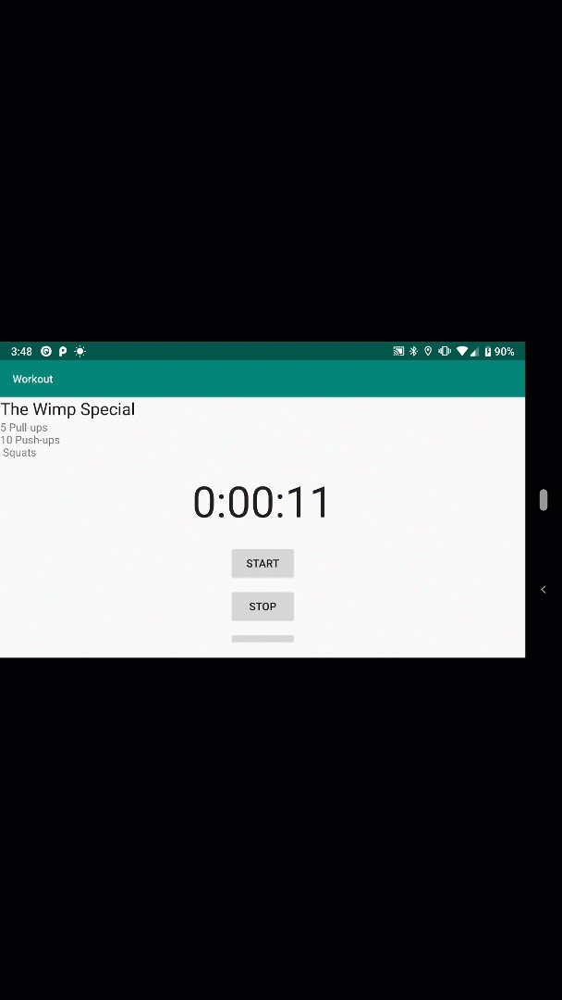

This is the continuation of the Workout app. One of the biggest issues I've been having was dealing with fragments and how to effectively use them. Below is a demonstration of an added feature that includes a timer in a separate fragment. 

#### <center><h2> Fragments Continued </h2></center>

Fragment lifecycle methods are the same as activity lifecycle methods but the major difference is that activity lifecycle methods are protected whereas fragment methods are public

Fragments cannot call methods like `findViewById()` directly. We need to find a reference to a View object and then call view’s `findViewById()` method.

In the exercise in Head First Java, I explored the option of nested fragments and how we can combine them together. The post here will be referring to my [github link](https://github.com/kxdang/Android-Development/tree/master/Workout-App) that goes through the exercise and my blog post is to recap what I’ve learned for future reference.

Activities lose their state of any instance variables when rotated because activities are destroyed and recreated when device is rotated. We solved this by saving and restoring the state of any instance variables used.

So when the device becomes rotated, it recreates the activity and if it contains the fragment element, it **re-inserts a new version of the fragment each time the activity is recreated.** That means any instance of the variables in fragments get discarded and set back to zero.

## <center>How do we solve this issue?</center>

We use something called a **Fragment Transaction**. We add a placeholder for the fragment in the activity’s layout. We add a frame layout to the layout and give it an ID to refer back to Java. Replaced the `<fragment>` element with `<FrameLayout>` in the xml file.

**Fragment Transaction **allows us to add a fragment to the frame layout. We add code to the TempActivity as soon as it gets created.

```java
    public class TempActivity extends AppCompatActivity {

       @Override
       protected void onCreate(Bundle savedInstanceState) {
           super.onCreate(savedInstanceState);
           setContentView(R.layout.activity_temp);

           if (savedInstanceState == null) {
               StopwatchFragment stopwatch = new StopwatchFragment();
               FragmentTransaction ft = getSupportFragmentManager().beginTransaction();
               ft.add(R.id.stopwatch_container,stopwatch);
               ft.addToBackStack(null);
               ft.setTransition(FragmentTransaction.TRANSIT_FRAGMENT_FADE);
               ft.commit();
           }
       }
    }
```

The code will check whether `savedInstanceState` Bundle parameter is null, this means that the `TempActivity` is being **created for the first time,** therefore we add `StopwatchFragment` to the Activity.

If `savedInstanceState` is not null, that means `TempActivity` is being **recreated** after being destroyed. We do not want to add a new instance of the fragment as it will overwrite the fragment. Below is the result of being able to call back the saved states in separate fragments as the activity becomes destroyed upon rotation.



When connecting the workout fragment and Stopwatch fragment, I used the `getChildFragment()` which allows fragments to be nested. This will reduce the transaction stack and allow us to **escape both fragments **at the same time when the user presses the back button.

In this case below we need to add similar code, however, the `getSupportFragmentManager()` gets replaced with `getChildFragmentManager()`:

```java
    public void onCreate(Bundle savedInstanceState) {
       super.onCreate(savedInstanceState);
       if (savedInstanceState == null) {
           StopwatchFragment stopwatch = new StopwatchFragment();
           FragmentTransaction ft = getChildFragmentManager().beginTransaction();
           ft.add(R.id.stopwatch_container, stopwatch);
           ft.addToBackStack(null);
           ft.setTransition(FragmentTransaction.TRANSIT_FRAGMENT_FADE);
           ft.commit();


       } else {
           workoutId = savedInstanceState.getLong("workoutId");
       }

    }

```

I realized that the more practice I have with Android SDK, the more familiar and comfortable I become when creating apps. I make sure that all my strings go into the `strings.xml` and use `styles.xml` when necessary. In addition, making small changes like the colour scheme and figuring out how to debug is all part of the learning process in my journey.
