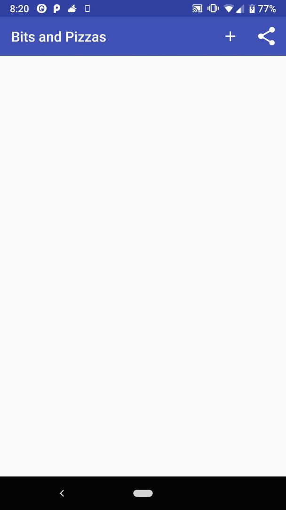
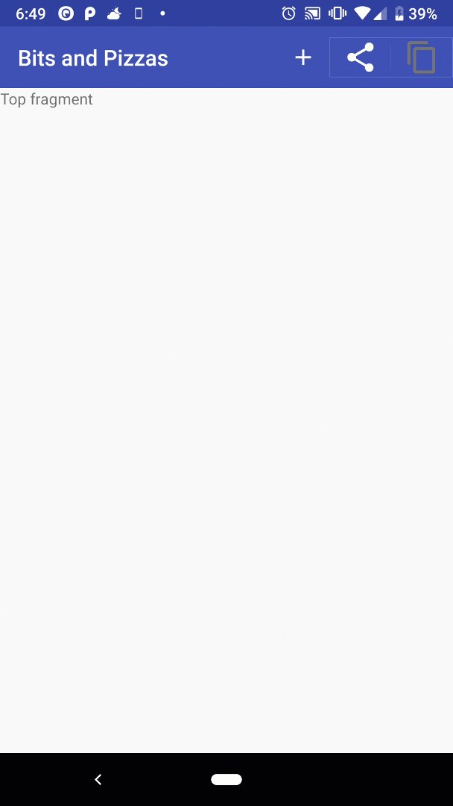

Android Design Support Library allows developers to create apps with an intuitive UI. For the initial exercise, I created a custom toolbar with a share, a plus and an Up button for navigation. In order to achieve the result below I had to remove the basic app bar and replace with a toolbar.


#### <center>Adding the ToolBar</center>

Removing the toolbar requires navigating to the `styles.xml` file and changing the parent theme to `parent=”Theme.AppCompat.Light.NoActionBar”`

If a toolbar is going to show in multiple activities, then it must be a separate layout to prevent repetition of code for every activity. I had to make a new `toolbar.xml` so that I can include it in all the activities in this app.  The xml contains the code below:

```xml
    <?xml version="1.0" encoding="utf-8"?>
    <android.support.v7.widget.Toolbar
       xmlns:android="http://schemas.android.com/apk/res/android"
       android:layout_width="match_parent"
       android:layout_height="?attr/actionBarSize"
       android:background="?attr/colorPrimary"
       android:theme="@style/ThemeOverlay.AppCompat.Dark.ActionBar" />
```

Now we include the custom toolbar in several activities by introducing the include tag in the xml file.

```xml
    <include
       layout="@layout/toolbar_main"
       android:id="@+id/toolbar"></include>
```

We need to connect it to the activity so that it acts like an app bar by calling the AppCompatActivity's `setSupportActionBar()` method in the `onCreate()` method of our main activity. The parameter will be the toolbar object that is referenced by it's XML id.



#### <center>Adding Action and Share to the Toolbar</center>

Creating the Order Action that will open a new activity called `OrderActivity`. In OrderActivity, we will include the custom toolbar we created. We add the `android:label=@string/create_order` to change the custom toolbar’s name for OrderActivity in the Android Manifest. From here, we need to edit the menu resource file which tells Android what actions we want in the toolbar. The `menu_main.xml` gets filled with this code below to add the + sign and the share button.

```xml
    <menu xmlns:android="http://schemas.android.com/apk/res/android"
       xmlns:app="http://schemas.android.com/apk/res-auto">
       <item android:id="@+id/action_create_order"
           android:title="@string/create_order_title"
           android:icon="@drawable/ic_add_white_24dp"
           android:orderInCategory="1"
           app:showAsAction="ifRoom">
       </item>

       <item android:id="@+id/action_share"
           android:title="@string/action_share"
           android:orderInCategory="2"
           app:showAsAction="ifRoom"
           app:actionProviderClass="android.support.v7.widget.ShareActionProvider">
       </item>

    </menu>
```

When completed, we need to add the functionality of the toolbar by implementing `onCreateOptionsMenu()` method. The one parameter it takes is a Menu object. Here we inflate the action share button with this code:

```java
    @Override
    public boolean onCreateOptionsMenu(Menu menu) {
           getMenuInflater().inflate(R.menu.main_menu, menu);
           MenuItem menuItem = menu.findItem(R.id.action_share);

           shareActionProvider = (ShareActionProvider) MenuItemCompat.getActionProvider(menuItem);
           setShareActionIntent("Want to join me for pizza?");

           return super.onCreateOptionsMenu(menu);
    }
```

For the onClick of the + icon, we throw an intent to the user to go to the OrderActivity screen.

```java
    @Override
    public boolean onOptionsItemSelected(MenuItem item) {
       switch (item.getItemId()) {
           case R.id.action_create_order:
               //Code to run when the Create Order item is clicked
               Intent intent = new Intent(this, OrderActivity.class);
               startActivity(intent);
               return true;
           default:
               return super.onOptionsItemSelected(item);
       }
```

When the Order Activity screen is present, we will need to add an Up button which allows the user to go back to the previous activity. The reason why we use an Up button over the back navigation button is because its based on the app's hierarchical structure. Using the regular back button will work through the history of activities the user has gone through.

An Up button will reduce the amount of times they need to press back to go to the main activity. We specify the order of activities in the Android Manifest where we reference the parent's activity.

#### <center>Adding the Up Button</center>

First we reference the app bar using activity's `getSupportActionBar()` method. Then call its `setDisplayHomeAsUpEnabled()` to be true. We call this on the onCreate of the OrderActivity.

```java
    public class OrderActivity extends AppCompatActivity {

       @Override
       protected void onCreate(Bundle savedInstanceState) {
           super.onCreate(savedInstanceState);
           setContentView(R.layout.activity_order2);
           Toolbar toolbar = findViewById(R.id.toolbar);
           setSupportActionBar(toolbar);
           ActionBar actionBar = getSupportActionBar();
           actionBar.setDisplayHomeAsUpEnabled(true);
       }
```

#### <center>Enable swiping gestures to navigate through fragments</center>

In this exercise, I added a swipe gesture that allows user to navigate through the different fragments available. The swipe gesture is accompanied by tabs which allow the user to know which screen they are currently in.

The following steps that were required to accomplish making tabs:

1. Create the fragments

2) Enable swipe navigation

3. Add the tab layout

#### <center>Creating the fragments</center>

After lots of practice, we see similar code below for different fragments as seen from the Earthquake app, I used ListFragment which allows us to display the list of items. The first step was to store the string array in the `strings.xml` with the following code:

```xml
    <string-array name="pizzas">
       <item>Diavolo</item>
       <item>Funghi</item>
    </string-array>
```

The string array has a name "pizzas" which allow me to reference list of data. The ListFragments needed to be inflated using the `LayoutInflater` and `ViewGroup` method:

```java
    public class PizzaFragment extends ListFragment {
       @Override
       public View onCreateView(LayoutInflater inflater, ViewGroup container, Bundle savedInstanceState) {

           ArrayAdapter<String> adapter = new ArrayAdapter<>(
                   inflater.getContext(),
                   android.R.layout.simple_list_item_1,
                   getResources().getStringArray(R.array.pizzas));
           setListAdapter(adapter);
           return super.onCreateView(inflater, container, savedInstanceState);
       }
```

The fragments `onCreateView` method requires a `LayoutInflator`, `ViewGroup` and `Bundle` with the variables name stored in the corresponding line.

The ArrayAdapter populates the ListFragments ListView with the pizza name. The inflater will get the context and display it like a simple list item (in this case, android has built in XML layout) and the getResources points to my XML reference of pizzas to generate the items. setListAdapter takes in the adapter and generates it. The return method returns all 3 parameters and uses the onCreateView method.

#### <center>Enabling the swipe gesture </center>



To enable swipe navigation, we need to use something called a **view pager** which is a view group that allows the user to swipe through different pages where we will stuff our fragments in.

To accomplish this, the main activity XML must add the view pager below. The key notes to remember is that there must be an ID reference to this pager because we need to reference it in our activity code.

```xml
    <android.support.v4.view.ViewPager
       android:id="@+id/pager"
       android:layout_width="match_parent"
       android:layout_height="match_parent" />
```

In the main activity, we use a **fragment pager adapter** which will allow us to get the view pager to display the fragments in each of its pages. Two important information you must pass is:

1. Number of pages

2) Which fragment should be displayed in each page

We create a class that extends the `FragmentPagerAdapter` which means we will inherit specific methods that will be required to display our fragments. These methods will include `getCount()` - which we will return 4 because we want to have 4 pages to display 4 different fragments and the second method `getItem()` will return an integer where it returns 0-3 for each specified fragment for each case.

```java
    private class SectionsPagerAdapter extends FragmentPagerAdapter {

       public SectionsPagerAdapter(FragmentManager fm) {
           super(fm);
       }

       @Override
       public int getCount(){
           return 4;
       }

       @Override
       public Fragment getItem(int position) {
           switch (position) {
               case 0:
                   return new TopFragment();
               case 1:
                   return new PizzaFragment();
               case 2:
                   return new PastaFragment();
               case 3:
                   return new StoresFragment();
           }
           return null;
       }
```

Lastly, we attach the `SectionsPagerAdapter` to the view pager by using a method called `ViewPagersetAdapter()` in the onCreate of our activity.

A `ViewPager` object is created called pager and we access a method `setAdapter()` where we pass the `pagerAdapter` which is a `SectionsPagerAdapter` object we created above.

```java
    @Override
    protected void onCreate(Bundle savedInstanceState) {
       super.onCreate(savedInstanceState);
       setContentView(R.layout.activity_main);
       Toolbar toolbar = findViewById(R.id.toolbar);
       setSupportActionBar(toolbar);

       //Attach SectionsPagerAdapter to the ViewPager
       SectionsPagerAdapter pagerAdapter = new SectionsPagerAdapter(getSupportFragmentManager());

       ViewPager pager = findViewById(R.id.pager);
       pager.setAdapter(pagerAdapter);


    }
```

#### <center>Adding Navigation Tabs</center>

For the end product, we will use classes from the Android Design Support Library which has a TabLayout and AppBarLayout built in Android. AppBarLayout will allow us to hold our ToolBar and the tabs that we will create. The XML changes will happen in our main activity xml and will require specific IDs to reference them.

```xml
    <LinearLayout
       xmlns:android="http://schemas.android.com/apk/res/android"
       xmlns:tools="http://schemas.android.com/tools"
       android:orientation="vertical"
       android:layout_width="match_parent"
       android:layout_height="match_parent"
       tools:context=".MainActivity">

       <android.support.design.widget.AppBarLayout
           android:layout_width="match_parent"
           android:layout_height="wrap_content"
           android:theme="@style/ThemeOverlay.AppCompat.Dark.ActionBar">

           <android.support.v7.widget.Toolbar
               android:id="@+id/toolbar"
               android:layout_width="match_parent"
               android:layout_height="?attr/actionBarSize" />

           <android.support.design.widget.TabLayout
               android:id="@+id/tabs"
               android:layout_width="match_parent"
               android:layout_height="wrap_content" />

       </android.support.design.widget.AppBarLayout>


       <android.support.v4.view.ViewPager
           android:id="@+id/pager"
           android:layout_width="match_parent"
           android:layout_height="match_parent" />


    </LinearLayout>
```

Next, we add the following tab titles in the `string.xml` and implement the `getPageTitle()` method from fragment pager adapter. The code snippet is below:

```java
    @Override
    public CharSequence getPageTitle(int position) {
       switch(position) {
           case 0:
               return getResources().getText(R.string.home_tab);
           case 1:
               return getResources().getText(R.string.pizza_tab);
           case 2:
               return getResources().getText(R.string.pasta_tab);
           case 3:
               return getResources().getText(R.string.store_tab);
       }
       return null;
    }
```

Then we attach the view pager to the tab layout with the following code:

```java
    TabLayout tabLayout = findViewById(R.id.tabs);
    tabLayout.setupWithViewPager(pager);
```

TabLayout is being initialized called `tabLayout` that references the ID tab and we call its `setupWithViewPager()` method and pass in our `ViewPager` to connect everything. And viola! We have this beautiful tab navigation that follows material design. I will be using this post as a reference to build my own tab navigation for my future projects.
