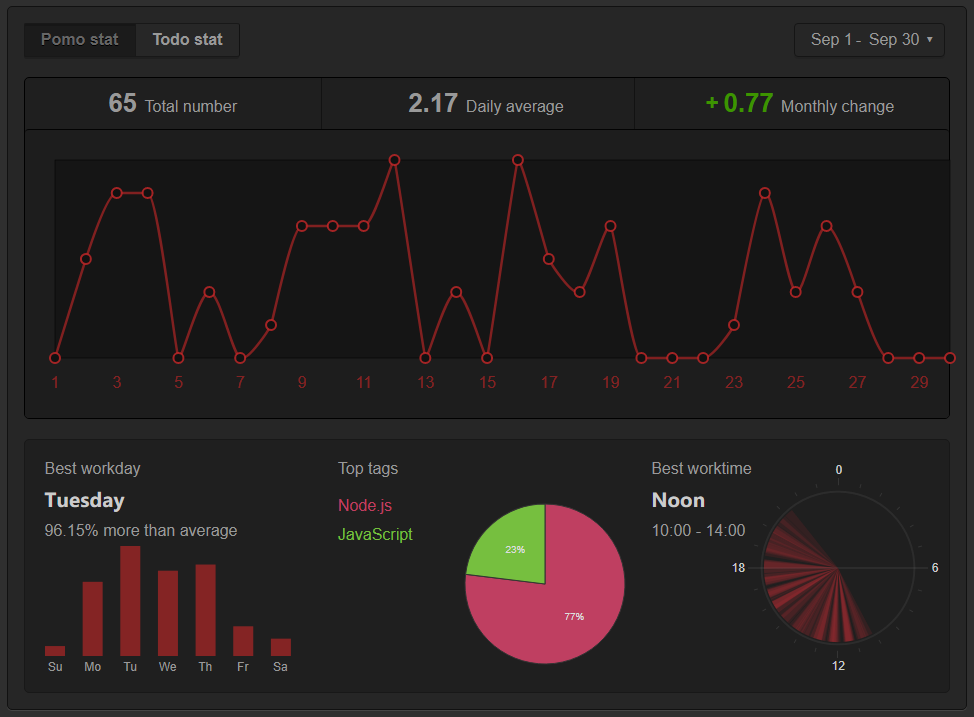

I’ve completed 65 total pomodoros in September which is 23 pomodoros more than [last month](/054-august-2019-pomodoro/). This is an increase in productivity by 575 minutes. Having reflections allow me to measure how much I’ve done and what I’ve accomplished to achieve my goals. It helps me stay accountable in my journey in completing my NodeJS course.

I’ve set a goal to do at least 4 pomodoros per day since I’m still recovering. During this month I’ve completed my Modern JavaScript Bootcamp course on Udemy and have learned a lot. My two projects are up and running via Netlify and I will try have them completed by the year-end to add to my portfolio.

I’m satisfied with this result. I’m hoping by the end of October to see my number of pomodoros increase.
