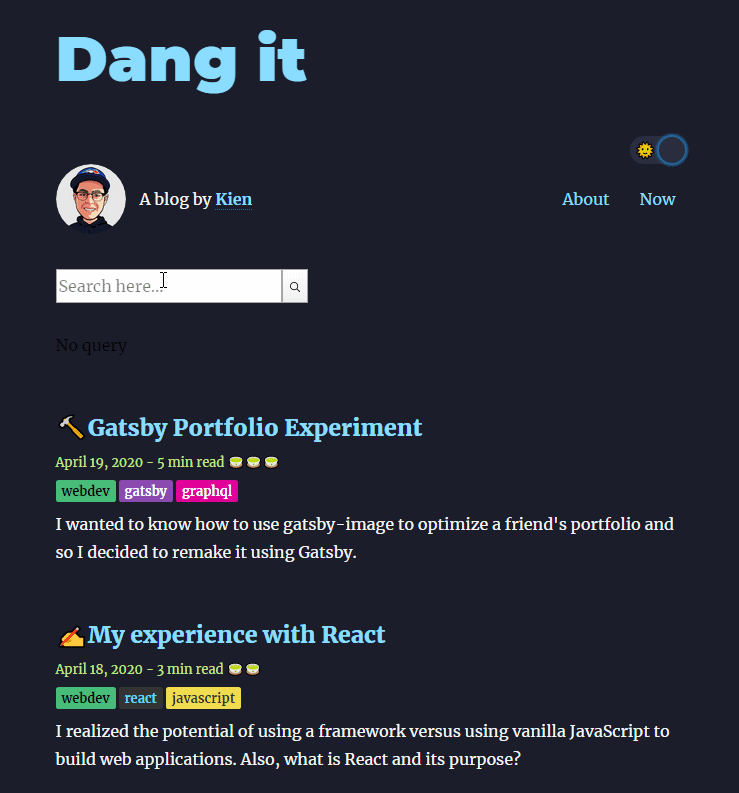
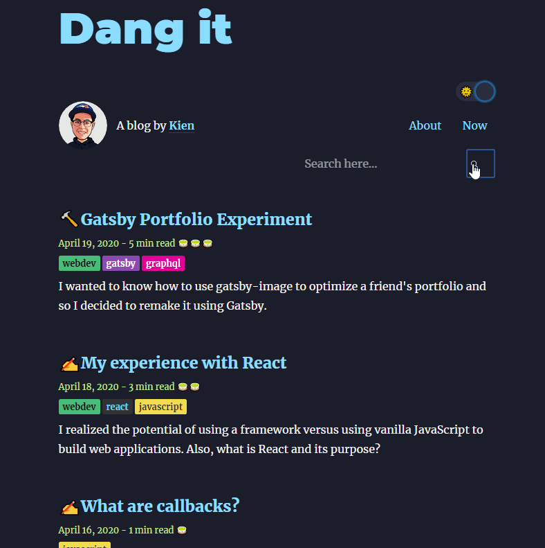

The guide I used was found on the Gatsby's documentation with a supplementary live stream found <a href="https://www.gatsbyjs.org/docs/adding-search-with-algolia/" target="_blank">here</a>. 

Both did a great job of explaining the process to help me get started, however, I ran into several issues that I couldn't fix and things have seemed to changed slightly since the recording of the stream. I had a lot of help from my friend Adrian. (Thanks Adrian!)

The documentation felt a little overwhelming, it included an installation of styled-components which is something I'm not to familiar with, so I decided to document and create my own guide for reference and for those just starting off building their own blog.
 
I wanted a more beginner guide for me to follow and made my own below. Here are the steps I used to install Algolia on my own blog:

## <center>Step 1</center>
Install the gatsby-plugin-algolia and react-instantsearch-dom, these two dependencies will be the main building blocks of this feature.

```
npm install --save gatsby-plugin-algolia react-instantsearch-dom algoliasearch dotenv
```
<br/>

## <center>Step 2</center>

Update your gatsby-config.js

```JavaScript{numberLines: true}
const queries = require("./src/utils/algolia")

require("dotenv").config({
   path: `.env.${process.env.NODE_ENV}`
})

module.exports = {
  plugins: [
		//--other plugins you might have --//
    {
      resolve: `gatsby-plugin-algolia`,
      options: {
        appId: process.env.GATSBY_ALGOLIA_APP_ID,
        apiKey: process.env.ALGOLIA_ADMIN_KEY,
        queries,
        chunkSize: 10000, // default: 1000
      },
    },
	 //--other plugins you might have --//
  ],
}
```
<br/>

You're going to have to add 3 things to your `gatsby-config.js` shown above. I will be going through them one by one. After you update your `gatsby-config.js` file, you need to do the following steps below:


### <center> Step 2a </center>

Create an [Algolia](https://www.algolia.com/) account and create an index. I named my index "Blog" - this is important to remember as you will need to reference it in indexName to explicitly define your indices on Algolia.

### <center> Step 2b </center>

Create an .env file on your root folder that contains your credentials, you will need both:
.env.production and .env.development - this will allow you to access the credentials when you build it locally.

```JavaScript
GATSBY_ALGOLIA_APP_ID=YOURCREDIENTIALS
GATSBY_ALGOLIA_SEARCH_KEY=YOURCREDIENTIALS
ALGOLIA_ADMIN_KEY=YOURCREDIENTIALS
```
<br/>

**When you deploy it to production, you will need to go to through your CMS and enter the API credentials. I use Netlify, so I entered my values under build settings**

You'll find these credentials on your Algolia dashboard.

### <center> Step 2c </center>
Create a new file called algolia.js and save the file anywhere you like, it doesn't matter since we will be using the require method in Line 1 (in Step 2) to export queries to gatsby-config, this file will contain your GraphQL query. 

In my case, I wanted to query for my blog posts so I ended up using the same information I use to display my posts. Yours might look a little different, I have MDX installed which allows me show both MD and MDX files, if you use regular MD posts, you can use the allMarkdownRemark query.

I stored my query in `src/utils/algolia.js`

```JavaScript{numberLines:true}
const blogQuery = `
{
  allMdx {
    edges {
      node {
        id
        frontmatter {
          description
          date(formatString: "MMMM DD, YYYY")
          tags
          title
        }
        fields {
          readingTime {
            minutes
            text
          }
          slug
        }
        excerpt
      }
    }
  }
}
`

const flatten = arr =>
    arr.map(({ node: { frontmatter, ...rest } }) => ({
        ...frontmatter,
        ...rest,
    }))

 // OPTIONAL SETTINGS
const settings = { attributesToSnippet: [`excerpt:20`] }

const queries = [
    {
        query: blogQuery,
        indexName: "Blog", //OPTIONAL
        transformer: ({ data }) => flatten(data.allMdx.edges),
        settings // OPTIONAL
    }
]

module.exports = queries
```

There are a couple of things happening in this file, the first section is querying for my blog posts (lines 1-25), or any data that I want the search to have access to, you can play around with this using the graphql playground.

There is a function called flatten (lines 27-31). I took it from the documentation, it flattens the data so that Algolia can search through it. The settings function is optional but I put it in there anyways.

Lines 35-42 is an an important key in the plugin's requirement, it is your graphql query that will connect to Algolia. I will be uploading blogQuery in line 37, referenced above in line 1. I provided the indexName in line 38 - which is the name created in the Algolia dashboard.

## <center> Step 3 </center>
Based on where you want your search to show, this is where you want the data to show up when you search. It can be in a modal, a separate page or even the front page.

I decided to put mine in the front page for simplicity's sake.

Now import Algolia's InstantSearch component, this is where all the magic happens, the structure should look like something below:

```jsx
import {
  InstantSearch,
  Hits,
  SearchBox,
} from "react-instantsearch-dom"
import algoliasearch from "algoliasearch/lite"

const Hit = ({ hit }) => <p>{hit.title} - {hit.excerpt}</p>

return(
	<Layout>
     ...
	  <InstantSearch searchClient={searchClient} indexName="Blog">
	    <SearchBox />
	     <Hits hitComponent={Hit} />
	    </InstantSearch>
     ...
    </Layout>
)

```

The `Hit` component will show the results of your search and you can pass it in the hitComponent data to control what you want to show in your results. In this case, I only pulled out the title and excerpt, the results are generated in a list which can be styled to your liking.


The data is extracted from the hit object just as if you were to query it out from GraphQL. I have only the title and excerpt extracted as seen above in the Hit function.

## <center>Remove default results</center>
Algolia's ReactInstantSearch always shows you results even when the query is empty, in their documentation it shows you how to handle this.

Here's how I managed mine, I had to wrap my head around how higher-order components are used and how they pass data to one another. The children prop in the Results component contains my Hit searches and displays it based on the conditional that was written in Results.

```jsx
import {
  InstantSearch,
  Hits,
  SearchBox,
} from "react-instantsearch-dom"
import algoliasearch from "algoliasearch/lite"

const Hit = ({ hit }) => <p>{hit.title} - {hit.excerpt}</p>

const Results = connectStateResults(({ searchState, children }) =>
      searchState && searchState.query ? (
        <div>
          <p>Searching for query {searchState.query}</p>
          {children}
        </div>
      ) : (
          <div>No query</div>
        )
    );

return(

	<Layout>
     ...
        <InstantSearch searchClient={searchClient} indexName="Blog">
            <SearchBox />
                <Results>
                    <Hits hitComponent={Hit} />
                 </Results>
        </InstantSearch>
     ...
  </Layout>

)

```

Here's what it looks like now!



Now it's just a bit of cleaning up, I made a separate component called SearchPreview, I made it look like my post preview and extracted the information from hit. So my Hit function looks like this:

```jsx{numberLines:true}
const Hit = ({ hit }) => 
    <SearchPreview
        hit={hit} 
        title={hit.title} 
        expert={hit.exerpt} 
        description={hit.description} 
        slug={hit.fields.slug} 
        readingTime={hit.fields.readingTime} 
        date={hit.date} 
    />
```

## <center> Installing Highlighting feature </center>
If you want Highlight to work, you must add the Highlight component inside the component that generates inside the Hit function.

For my case, I wanted to be able to search for the title of my blog and my excerpt. So inside my SearchPreview, I passed down the hit data as a prop in line 3 above. This will allow the Highlight component in the Search component to add the magic.

Searching for the title just requires you to replace the title with the Highlight component:

```jsx
//inside SearchPreview.js
import { Highlight } from "react-instantsearch-dom"

function SearchPreview({ hit, title, excerpt, slug }) {
    return (
    <div>
      <h3
        style={{
            marginBottom: rhythm(1 / 4),
        }}
       >
          <Link
            style={{ boxShadow: `none`, borderBottom: "none" }}
            to={slug}
          >
            <Highlight 
              hit={hit} 
              attribute="title" 
              tagName="mark" 
              />
          </Link>
      </h3>
        ...

export default SearchPreview
```

You can add a tagName attribute which will allow you to italicize the searched query and highlight the word. It is customizable through CSS under the `mark` tag. After some CSS magic, it'll look something like below!



A simple Algolia search for your blog! Algolia has a free tier which is the perfect use case since I will be writing about programming, I'll finally be able to search for topics I need to frequently review. 

It's also a better way to peek into my brain instead of sifting through pages and laugh at my writing during during my initial days of this blog.

My next step is learning how to denounce the Algolia search, perhaps using lodash to reduce the operations count per month in the free tier. If this post helped you out feel free to buy me a coffee!

<a href="https://www.buymeacoffee.com/notcodenames" target="_blank" style="border-bottom: none;"></a>