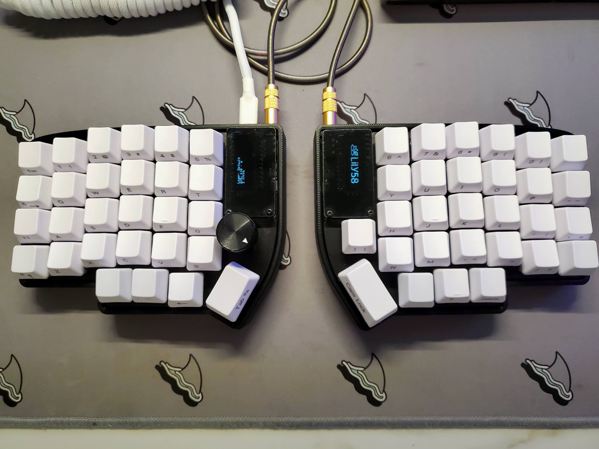
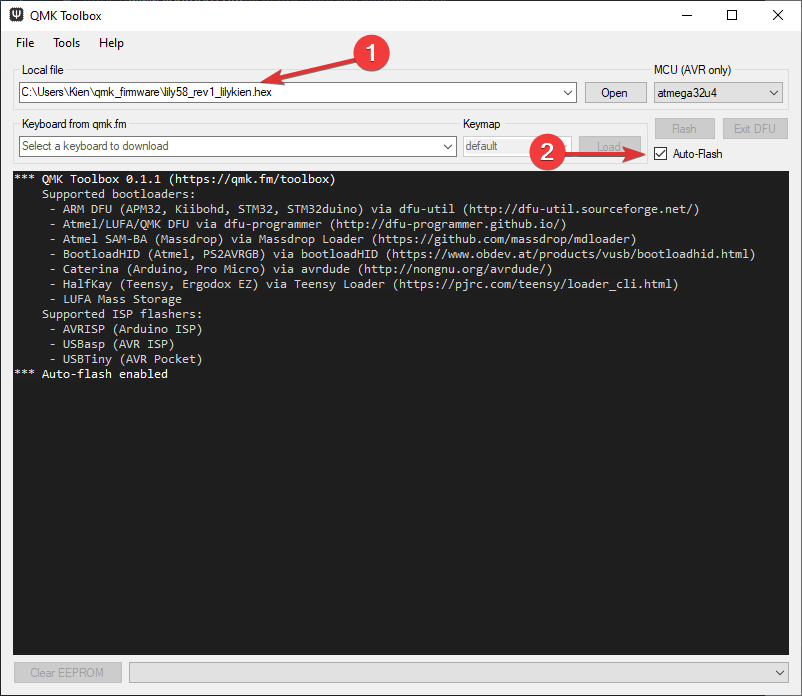

_Disclaimer: I am not responsible for any bricked devices that may occur if you follow my instructions. This post is to serve as a guide for myself and what I found helpful to me on my journey on compiling my own firmware for my keyboard. Please follow at your own risk._

# <center>Fixing the OLEDs</center>



I recently purchased a completely functional, second hand lily58pro keyboard. I was able to flash the firmware using the online QMK configurator and QMK Toolkit, however, I could not get the OLED's to turn on.

After doing some research, I found that you cannot turn on the OLED's from the lily58pro using the online QMK configurator and you must create a QMK build environment to pass the `OLED_ENABLE= yes` in the `rules.mk` file.

If you just built your lily58 keyboard or you have one you purchased but have no idea how to turn the OLEDs on and it works perfectly fine, you can try this solution. I spent 3 hours trying to understand how it works and digging through the <a href="https://beta.docs.qmk.fm/tutorial/newbs" target="_blank">docs</a> and I wrote the steps below on what I did to get them to turn on.

Please note that if you have other problems with your lily58pro and the OLED's aren't working, please check your soldering and troubleshoot the hardware first before attempting a fix though firmware.

For my situation, my OLED on my left keyboard would turn on briefly with weird artifacts so I had some hope that it was working and attempted to turn them on via firmware.

## <center>The Steps</center>

1. Install and setup the QMK Configurator and download the QMK Toolkit

2. Open up the QMK MSYS and make sure you're in the `qmk_firmware` folder

3. Run `qmk new-keymap`

   a. For keyboard name enter `lily58`

   b. For keymap name, name it whatever you want, I named mine `lilykien`

4. Compile the keymap using the command it tells you to, for me, its

`qmk compile -kb lily58 -km lilykien`

5. After this is done, it will create the keymap in the lily58 folder, so in my case:

`C:/Users/Kien/qmk_firmware/keyboards/lily58/keymaps/lilykien`

- Note this will load a default keymap to the lily58, if you want to edit or load your own preset, I highly recommend using the online QMK configurator, download the json and and run the json2c command so you can simply copy over the keymappings. For more details, scroll to [here.](#oleds-work-but-i-want-to-customize-the-keymappings)

5. Compile your firmware by using the command:

   `make lily58/rev1:lilykien`

If you have the rgb version, the command would be:

`make lily58/light:lilykien`

This will create the hex file named `lily58_rev1_lilykien.hex` in the root folder of the QMK file.

`C:/Users/Kien/qmk_firmware/lily58_rev1_lilykien.hex`

Now all I have to do is flash this hex file using the QMK Toolbox because when you compile, the `rules.mk` file already has the `OLED_ENABLE=yes` by default which is exactly what I needed.

# OLEDs work but I want to customize the keymappings

Go to the <a href="https://config.qmk.fm/#/tkc/tkl_ab87/LAYOUT_all" target="_blank">QMK online configurator</a> and use the browser UI to set up all the keys you want, make sure you select the lily58 if that's what you're using.

1. Once you are done, download the **FULL SOURCE**

Inside the downloaded file, you'll notice the file structure is similar to the qmk_firmware files you have installed on your machine from the QMK MSYS.

2. Open up the downloaded firmware you installed and extract the .json file, it should have a similar name of the .hex file.

For me, its named `lily58-rev1-lily58_rev1_layout_mine.json`

3. Drag and drop this file into the root of your qmk_firmware folder and run the following command from the QMK MSYS to convert the json file to the keymap.c file

`qmk json2c lily58-rev1-lily58_rev1_layout_mine.json -o customkeymap.c`

4. You should see the `customkeymap.c` file generate in the root folder and now you want to open that up with vscode and copy the line that contains the `uint16_t` function and paste it in the `keymap.c` file thats generated.

```js
const uint16_t PROGMEM keymaps[][MATRIX_ROWS][MATRIX_COLS] = {

 [_QWERTY] = LAYOUT(...etc)

 [_LOWER] = LAYOUT(...etc)

 [_RAISE] = LAYOUT(...etc)

 [_ADJUST] = LAYOUT(...etc)
};
```

Find the `keymap.c` file for the lily58, it should be located under the lily58 keymaps folder.

e.g `C:/Users/Kien/qmk_firmware/keyboards/lily58/keymaps/lilykien`

**Flashing instructions:**



I do the main board first, since my left one has the elite C controller, I use a USB C cable and disconnect the TRRS cable that connects the right side of my keyboard.
I press on flash button next to the OLEDs and the auto flash from the QMK Toolkit should do the trick.

After, I unplug the left board and use a micro USB on the right side which uses the pro micro controller and flash it the same way.

Voilà! Uou should see your OLEDs working now, all thats left is to find the bongo cat so that it smacks the table as you type and show your WPM!

Bonus Pic:


