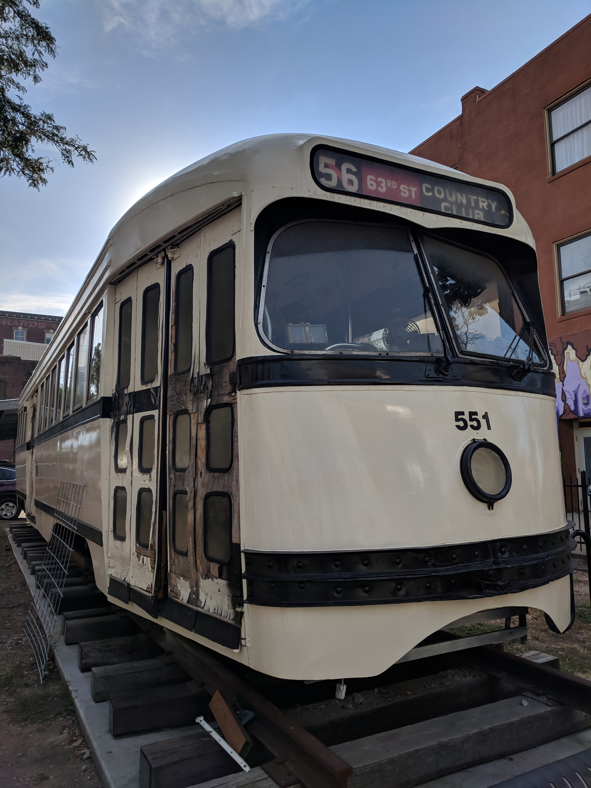

You're probably wondering, why Kansas City?

Disclaimer: I went to Kansas City for work meetings.

Kansas City is the largest city in Missouri. I found it hard to believe that this massive city only has a population of around 490,000. When compared to Toronto, which has a population of 2.8 million people, it feels very open and spacious. Kansas City is known for their delicious BBQ, jazz heritage and their fountains.

When I landed, it was 37 degrees, pure sunshine and no cloud in sight. I had to say that the week I was there from Aug 6-10, it was very hot. The weather averaged around 36 degrees. I stayed at the Argosy Casino Hotel & Spa.

One of the main places we went during the evening was the **Kansas City Power & Light District** where live music is held, tons of restaurants to eat surrounding a very cozy outdoor gathering place.

**Food**

- **Country Road Ice House** - BBQ was really good, better than what we have in Toronto

- **Hereford House**- I was told by many that Kansas City has the one of the best steaks, definitely took that one off the bucket list here at this steakhouse

- **Nick & Jake's** **Restaurant **- Can't go to the states without trying their American cuisine. Really spacious space for awesome seafood and sandwiches

- **Rancho Grande Cantina**- Really homey Mexican restaurant, their salsa is delicious here

- **Tribe Street Kitchen** - world street kitchen and bar that's situated in the historic River Market District. We ordered a lot of interesting dishes and their cocktails were really good

- **Green Lady Lounge**- Open seating jazz bar. Enjoyed a classic old fashion and tried a dirty martini for the first time. Jazz musicians play live here and the atmosphere is perfect for a night out

- **Chicken N Pickle**- Casual eatery & bar with pickleball courts, backyard games and a shaded beer garden. Very nice atmosphere and very open.

Their public transit is completely free in downtown which is awesome and they have 3 cool bridges going across the river. The downtown buildings are pretty neat with a touch of art in every corner. Despite this being a last minute trip, I thoroughly enjoyed the experience of being somewhere new.

