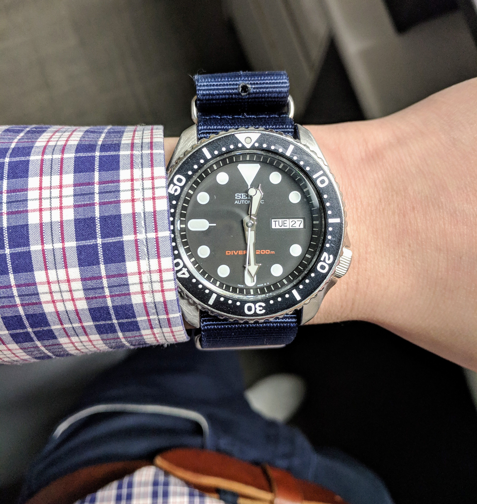

The famous Seiko SKX007, an iconic timepiece known by many watch enthusiasts. I’ve seen this specific model all over YouTube and articles but I’ve never had seen one in person until now.

There’s something that hints a person’s sense of taste when they wear an iconic timepiece. It shows the appreciation of traditional watchmaking and horology. For many, it could be a sense of style and expression and for others, an heirloom.

I instantly recognized the <a href="https://www.omegawatches.com/watches/speedmaster/moonwatch/professional/product" target="_blank">moon watch</a> on my colleagues wrist and asked him about it. He spent some time talking about how he got into the hobby of watches and a Seiko he inherited from his father. From there, I showed him my own Seiko watch and he told me he actually had more than the one Seiko in his collection. I immediately asked if one of them was the Seiko SKX007 and lo and behold, it was. He thanked me for asking about his watch and told me he would bring in the SKX007 for me to check it out.

My first impression when it arrived was how much better it looked in person than from the videos and pictures online. There was a certain depth to the actual watch face that is completely understated in pictures.

The watch feels very well made and when paired with a NATO, it gives the watch a very versatile look. The dial is minimal but functional and the lume is excellent. I was hesitant on wearing a 41mm watch as my wrists are only 6.5”, but to my surprise, it wore smaller than expected, the lugs almost going over my wrist.

The Seiko SKX007 was produced in 1996 with an in-house 7s26 movement, known to be extremely robust and reliable with very minimal maintenance. An affordable submariner that is ISO 6425 certified for all under $200 USD. It also has a unique utilitarian styling which makes it very easy to spot. Unfortunately, the model has been discontinued and now goes for a whopping $300 CAD.

A new lineage of watches from Seiko was announced which is the Seiko Mini-Turtle, a watch that resembles a hybrid of the SKX007 and the Turtle. Perhaps I'll reward myself with the new apparent heir and forego the famous SKX007.

If I'm able to find a great price on this watch, I would definitely pick this in a heartbeat. I’ve had the pleasure of wearing this watch for a week and had a great time bonding over watches with my colleague.
